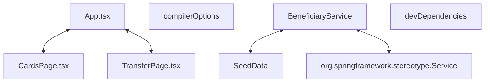

# Codebase Architectural Report

> **Auto-generated** by graphify knowledge graph analysis  
> **Purpose**: Dependency map, connection analysis, subsystem breakdown, and quality hotspots.

---

## 1. Executive Summary

- **Total Components**: `296`
- **Total Connections**: `456`
- **Subsystem Modules**: `25`
- **Dependency Types**: `8`

**Key Architectural Hubs:**

| # | Component | File | Type | Connections |
|---|-----------|------|------|-------------|
| 1 | `SeedData` | `backend/src/main/java/com/ansh/bank/common/config/SeedData.java` | class | 29 |
| 2 | `App.tsx` | `frontend/src/App.tsx` | class | 18 |
| 3 | `compilerOptions` | `frontend/tsconfig.json` | function | 15 |
| 4 | `org.springframework.stereotype.Service` | `` | function | 14 |
| 5 | `TransferPage.tsx` | `frontend/src/features/transfers/TransferPage.tsx` | class | 12 |
| 6 | `BeneficiaryService` | `backend/src/main/java/com/ansh/bank/beneficiary/service/BeneficiaryService.java` | class | 11 |
| 7 | `devDependencies` | `frontend/package.json` | function | 11 |
| 8 | `CardsPage.tsx` | `frontend/src/features/cards/CardsPage.tsx` | class | 11 |

---

## 2. Dependency & Connection Analysis

### Relationship Types

| Relationship | Count | Share |
|-------------|-------|-------|
| `references` | 131 | 29% |
| `imports` | 105 | 23% |
| `contains` | 94 | 21% |
| `method` | 63 | 14% |
| `imports_from` | 31 | 7% |
| `calls` | 28 | 6% |
| `extends` | 3 | 1% |
| `implements` | 1 | 0% |

### Hub Dependency Diagram

### Most Connected Pairs

| Component A | Component B | Shared Connections |
|-------------|-------------|-------------------|
| `.all()` | `Response` | 8 |
| `.all()` | `GetMapping` | 4 |
| `.add()` | `Response` | 4 |
| `.add()` | `CreateRequest` | 4 |
| `.map()` | `Response` | 3 |
| `.login()` | `LoginRequest` | 2 |
| `.login()` | `LoginResponse` | 2 |
| `.verify()` | `Response` | 2 |
| `.add()` | `PostMapping` | 2 |
| `.add()` | `.add()` | 2 |

---

## 3. Subsystem & Module Breakdown

### 3.1 backend/src/main/java/com/ansh/bank
**Nodes**: `36`  
**Files**: `backend/src/main/java/com/ansh/bank/common/config/SeedData.java`, `backend/src/main/java/com/ansh/bank/statement/controller/StatementController.java`, `backend/src/main/java/com/ansh/bank/support/service/SupportService.java`, `backend/src/main/java/com/ansh/bank/transaction/controller/TransactionController.java`, `backend/src/main/java/com/ansh/bank/transaction/dto/TransactionDtos.java`, `backend/src/main/java/com/ansh/bank/transaction/service/TransactionService.java`

| Component | Type | File | Connections |
|-----------|------|------|-------------|
| `SeedData` | class | `backend/src/main/java/com/ansh/bank/common/config/SeedData.java` | 29 |
| `TransactionService` | class | `backend/src/main/java/com/ansh/bank/transaction/service/TransactionService.java` | 9 |
| `TransactionController` | class | `backend/src/main/java/com/ansh/bank/transaction/controller/TransactionController.java` | 7 |
| `.transfer()` | method | `backend/src/main/java/com/ansh/bank/transaction/service/TransactionService.java` | 7 |
| `StatementController` | class | `backend/src/main/java/com/ansh/bank/statement/controller/StatementController.java` | 6 |
| `.transfer()` | method | `backend/src/main/java/com/ansh/bank/transaction/controller/TransactionController.java` | 5 |
| `TransactionService.java` | class | `backend/src/main/java/com/ansh/bank/transaction/service/TransactionService.java` | 5 |
| `TransactionDtos` | class | `backend/src/main/java/com/ansh/bank/transaction/dto/TransactionDtos.java` | 4 |
| `.csv()` | method | `backend/src/main/java/com/ansh/bank/statement/controller/StatementController.java` | 3 |
| `TransactionController.java` | class | `backend/src/main/java/com/ansh/bank/transaction/controller/TransactionController.java` | 3 |

**External dependencies:** `SupportService` (2), `ApiException` (2), `org.springframework.stereotype.Service` (2), `AccountService.java` (1), `AccountService` (1)

### 3.2 frontend/src
**Nodes**: `35`  
**Files**: `frontend/src/App.tsx`, `frontend/src/api/client.ts`, `frontend/src/components/AppShell.tsx`, `frontend/src/components/Ui.tsx`, `frontend/src/features/auth/LoginPage.tsx`, `frontend/src/features/auth/auth.test.tsx` +10 more

| Component | Type | File | Connections |
|-----------|------|------|-------------|
| `App.tsx` | class | `frontend/src/App.tsx` | 18 |
| `TransferPage.tsx` | class | `frontend/src/features/transfers/TransferPage.tsx` | 12 |
| `CardsPage.tsx` | class | `frontend/src/features/cards/CardsPage.tsx` | 11 |
| `Ui.tsx` | class | `frontend/src/components/Ui.tsx` | 10 |
| `BeneficiariesPage.tsx` | class | `frontend/src/features/beneficiaries/BeneficiariesPage.tsx` | 10 |
| `SupportPage.tsx` | class | `frontend/src/features/support/SupportPage.tsx` | 10 |
| `types.ts` | file | `frontend/src/types.ts` | 10 |
| `client.ts` | file | `frontend/src/api/client.ts` | 8 |
| `api` | function | `frontend/src/api/client.ts` | 8 |
| `Card()` | class | `frontend/src/components/Ui.tsx` | 8 |

### 3.3 backend/src/main/java/com/ansh/bank
**Nodes**: `31`  
**Files**: `backend/src/main/java/com/ansh/bank/auth/controller/AuthController.java`, `backend/src/main/java/com/ansh/bank/auth/dto/AuthDtos.java`, `backend/src/main/java/com/ansh/bank/auth/service/AuthService.java`, `backend/src/main/java/com/ansh/bank/common/config/SeedData.java`, `backend/src/main/java/com/ansh/bank/common/security/JwtAuthFilter.java`, `backend/src/main/java/com/ansh/bank/common/security/JwtService.java`

| Component | Type | File | Connections |
|-----------|------|------|-------------|
| `AuthService` | class | `backend/src/main/java/com/ansh/bank/auth/service/AuthService.java` | 9 |
| `JwtService` | class | `backend/src/main/java/com/ansh/bank/common/security/JwtService.java` | 9 |
| `.login()` | method | `backend/src/main/java/com/ansh/bank/auth/service/AuthService.java` | 7 |
| `AuthController` | class | `backend/src/main/java/com/ansh/bank/auth/controller/AuthController.java` | 6 |
| `AuthService.java` | class | `backend/src/main/java/com/ansh/bank/auth/service/AuthService.java` | 6 |
| `JwtAuthFilter` | class | `backend/src/main/java/com/ansh/bank/common/security/JwtAuthFilter.java` | 6 |
| `.login()` | method | `backend/src/main/java/com/ansh/bank/auth/controller/AuthController.java` | 5 |
| `.doFilter()` | method | `backend/src/main/java/com/ansh/bank/common/security/JwtAuthFilter.java` | 5 |
| `AuthDtos` | class | `backend/src/main/java/com/ansh/bank/auth/dto/AuthDtos.java` | 4 |
| `org.springframework.stereotype.Component` | function | `` | 4 |

**External dependencies:** `SeedData` (6), `org.springframework.stereotype.Service` (4), `ApiException` (2)

### 3.4 backend/src/main/java/com/ansh/bank/beneficiary
**Nodes**: `27`  
**Files**: `backend/src/main/java/com/ansh/bank/beneficiary/controller/BeneficiaryController.java`, `backend/src/main/java/com/ansh/bank/beneficiary/dto/BeneficiaryDtos.java`, `backend/src/main/java/com/ansh/bank/beneficiary/service/BeneficiaryService.java`

| Component | Type | File | Connections |
|-----------|------|------|-------------|
| `BeneficiaryService` | class | `backend/src/main/java/com/ansh/bank/beneficiary/service/BeneficiaryService.java` | 11 |
| `BeneficiaryController` | class | `backend/src/main/java/com/ansh/bank/beneficiary/controller/BeneficiaryController.java` | 8 |
| `.add()` | method | `backend/src/main/java/com/ansh/bank/beneficiary/controller/BeneficiaryController.java` | 5 |
| `.add()` | method | `backend/src/main/java/com/ansh/bank/beneficiary/service/BeneficiaryService.java` | 5 |
| `.verify()` | method | `backend/src/main/java/com/ansh/bank/beneficiary/controller/BeneficiaryController.java` | 4 |
| `BeneficiaryDtos` | class | `backend/src/main/java/com/ansh/bank/beneficiary/dto/BeneficiaryDtos.java` | 4 |
| `BeneficiaryService.java` | class | `backend/src/main/java/com/ansh/bank/beneficiary/service/BeneficiaryService.java` | 4 |
| `Response` | class | `` | 4 |
| `.verify()` | method | `backend/src/main/java/com/ansh/bank/beneficiary/service/BeneficiaryService.java` | 4 |
| `BeneficiaryController.java` | class | `backend/src/main/java/com/ansh/bank/beneficiary/controller/BeneficiaryController.java` | 3 |

**External dependencies:** `SeedData` (3), `org.springframework.stereotype.Service` (2)

### 3.5 backend/src/main/java/com/ansh/bank/support
**Nodes**: `25`  
**Files**: `backend/src/main/java/com/ansh/bank/support/controller/SupportController.java`, `backend/src/main/java/com/ansh/bank/support/dto/SupportDtos.java`, `backend/src/main/java/com/ansh/bank/support/service/SupportService.java`

| Component | Type | File | Connections |
|-----------|------|------|-------------|
| `org.springframework.stereotype.Service` | function | `` | 14 |
| `SupportService` | class | `backend/src/main/java/com/ansh/bank/support/service/SupportService.java` | 10 |
| `SupportController` | class | `backend/src/main/java/com/ansh/bank/support/controller/SupportController.java` | 7 |
| `.add()` | method | `backend/src/main/java/com/ansh/bank/support/controller/SupportController.java` | 5 |
| `.add()` | method | `backend/src/main/java/com/ansh/bank/support/service/SupportService.java` | 5 |
| `SupportDtos` | class | `backend/src/main/java/com/ansh/bank/support/dto/SupportDtos.java` | 4 |
| `SupportService.java` | class | `backend/src/main/java/com/ansh/bank/support/service/SupportService.java` | 4 |
| `SupportController.java` | class | `backend/src/main/java/com/ansh/bank/support/controller/SupportController.java` | 3 |
| `.all()` | method | `backend/src/main/java/com/ansh/bank/support/controller/SupportController.java` | 3 |
| `SupportDtos.java` | class | `backend/src/main/java/com/ansh/bank/support/dto/SupportDtos.java` | 3 |

**External dependencies:** `SeedData` (2), `AccountService.java` (1), `AccountService` (1), `AuthService.java` (1), `AuthService` (1)

### 3.6 backend/src/main/java/com/ansh/bank/card
**Nodes**: `23`  
**Files**: `backend/src/main/java/com/ansh/bank/card/controller/CardController.java`, `backend/src/main/java/com/ansh/bank/card/dto/CardDtos.java`, `backend/src/main/java/com/ansh/bank/card/service/CardService.java`

| Component | Type | File | Connections |
|-----------|------|------|-------------|
| `CardService` | class | `backend/src/main/java/com/ansh/bank/card/service/CardService.java` | 10 |
| `CardController` | class | `backend/src/main/java/com/ansh/bank/card/controller/CardController.java` | 8 |
| `CardService.java` | class | `backend/src/main/java/com/ansh/bank/card/service/CardService.java` | 4 |
| `CardController.java` | class | `backend/src/main/java/com/ansh/bank/card/controller/CardController.java` | 3 |
| `.all()` | method | `backend/src/main/java/com/ansh/bank/card/controller/CardController.java` | 3 |
| `Response` | class | `` | 3 |
| `.block()` | method | `backend/src/main/java/com/ansh/bank/card/controller/CardController.java` | 3 |
| `.unblock()` | method | `backend/src/main/java/com/ansh/bank/card/controller/CardController.java` | 3 |
| `CardDtos.java` | class | `backend/src/main/java/com/ansh/bank/card/dto/CardDtos.java` | 3 |
| `CardDtos` | class | `backend/src/main/java/com/ansh/bank/card/dto/CardDtos.java` | 3 |

**External dependencies:** `SeedData` (3), `org.springframework.stereotype.Service` (2)

### 3.7 backend/src/test/java/com/ansh/bank
**Nodes**: `22`  
**Files**: `backend/src/test/java/com/ansh/bank/AuthAccountApiTest.java`, `backend/src/test/java/com/ansh/bank/CardSupportApiTest.java`, `backend/src/test/java/com/ansh/bank/TransferBeneficiaryApiTest.java`

| Component | Type | File | Connections |
|-----------|------|------|-------------|
| `CardSupportApiTest` | class | `backend/src/test/java/com/ansh/bank/CardSupportApiTest.java` | 7 |
| `TransferBeneficiaryApiTest` | class | `backend/src/test/java/com/ansh/bank/TransferBeneficiaryApiTest.java` | 7 |
| `.headers()` | method | `backend/src/test/java/com/ansh/bank/CardSupportApiTest.java` | 6 |
| `.headers()` | method | `backend/src/test/java/com/ansh/bank/TransferBeneficiaryApiTest.java` | 6 |
| `org.springframework.boot.test.context.SpringBootTest` | function | `` | 6 |
| `org.springframework.boot.test.web.client.TestRestTemplate` | function | `` | 6 |
| `org.junit.jupiter.api.Test` | function | `` | 6 |
| `CardSupportApiTest.java` | class | `backend/src/test/java/com/ansh/bank/CardSupportApiTest.java` | 5 |
| `TransferBeneficiaryApiTest.java` | class | `backend/src/test/java/com/ansh/bank/TransferBeneficiaryApiTest.java` | 5 |
| `AuthAccountApiTest` | class | `backend/src/test/java/com/ansh/bank/AuthAccountApiTest.java` | 4 |

### 3.8 frontend/package.json
**Nodes**: `21`  
**Files**: `frontend/package.json`

| Component | Type | File | Connections |
|-----------|------|------|-------------|
| `devDependencies` | function | `frontend/package.json` | 11 |
| `@playwright/test` | function | `frontend/package.json` | 2 |
| `@testing-library/jest-dom` | function | `frontend/package.json` | 2 |
| `@testing-library/react` | function | `frontend/package.json` | 2 |
| `@testing-library/user-event` | function | `frontend/package.json` | 2 |
| `typescript` | function | `frontend/package.json` | 2 |
| `vite` | function | `frontend/package.json` | 2 |
| `vitest` | function | `frontend/package.json` | 2 |
| `jsdom` | function | `frontend/package.json` | 2 |
| `@types/react` | function | `frontend/package.json` | 2 |

**External dependencies:** `package.json` (1)

### 3.9 frontend/tsconfig.json
**Nodes**: `20`  
**Files**: `frontend/tsconfig.json`

| Component | Type | File | Connections |
|-----------|------|------|-------------|
| `compilerOptions` | function | `frontend/tsconfig.json` | 15 |
| `lib` | function | `frontend/tsconfig.json` | 3 |
| `tsconfig.json` | function | `frontend/tsconfig.json` | 2 |
| `include` | function | `frontend/tsconfig.json` | 2 |
| `target` | function | `frontend/tsconfig.json` | 1 |
| `useDefineForClassFields` | function | `frontend/tsconfig.json` | 1 |
| `DOM` | class | `frontend/tsconfig.json` | 1 |
| `ES2020` | class | `frontend/tsconfig.json` | 1 |
| `allowJs` | function | `frontend/tsconfig.json` | 1 |
| `skipLibCheck` | function | `frontend/tsconfig.json` | 1 |

### 3.10 backend/src/main/java/com/ansh/bank/account
**Nodes**: `15`  
**Files**: `backend/src/main/java/com/ansh/bank/account/controller/AccountController.java`, `backend/src/main/java/com/ansh/bank/account/dto/AccountDtos.java`, `backend/src/main/java/com/ansh/bank/account/service/AccountService.java`

| Component | Type | File | Connections |
|-----------|------|------|-------------|
| `AccountService` | class | `backend/src/main/java/com/ansh/bank/account/service/AccountService.java` | 8 |
| `AccountController` | class | `backend/src/main/java/com/ansh/bank/account/controller/AccountController.java` | 6 |
| `AccountService.java` | class | `backend/src/main/java/com/ansh/bank/account/service/AccountService.java` | 4 |
| `AccountController.java` | class | `backend/src/main/java/com/ansh/bank/account/controller/AccountController.java` | 3 |
| `.list()` | method | `backend/src/main/java/com/ansh/bank/account/controller/AccountController.java` | 3 |
| `AccountDtos.java` | class | `backend/src/main/java/com/ansh/bank/account/dto/AccountDtos.java` | 3 |
| `AccountDtos` | class | `backend/src/main/java/com/ansh/bank/account/dto/AccountDtos.java` | 3 |
| `AccountResponse` | class | `backend/src/main/java/com/ansh/bank/account/dto/AccountDtos.java` | 3 |
| `.AccountController()` | method | `backend/src/main/java/com/ansh/bank/account/controller/AccountController.java` | 2 |
| `.AccountService()` | method | `backend/src/main/java/com/ansh/bank/account/service/AccountService.java` | 2 |

**External dependencies:** `SeedData` (3), `org.springframework.stereotype.Service` (2)

### 3.11 frontend/package.json
**Nodes**: `14`  
**Files**: `frontend/package.json`

| Component | Type | File | Connections |
|-----------|------|------|-------------|
| `dependencies` | function | `frontend/package.json` | 5 |
| `scripts` | function | `frontend/package.json` | 4 |
| `package.json` | function | `frontend/package.json` | 3 |
| `@vitejs/plugin-react` | function | `frontend/package.json` | 2 |
| `axios` | function | `frontend/package.json` | 2 |
| `react` | function | `frontend/package.json` | 2 |
| `react-dom` | function | `frontend/package.json` | 2 |
| `dev` | function | `frontend/package.json` | 1 |
| `build` | function | `frontend/package.json` | 1 |
| `test` | function | `frontend/package.json` | 1 |

**External dependencies:** `devDependencies` (1)

### 3.12 backend/src/main/java/com/ansh/bank/common/exception
**Nodes**: `9`  
**Files**: `backend/src/main/java/com/ansh/bank/common/exception/ApiException.java`, `backend/src/main/java/com/ansh/bank/common/exception/GlobalExceptionHandler.java`

| Component | Type | File | Connections |
|-----------|------|------|-------------|
| `ApiException` | class | `backend/src/main/java/com/ansh/bank/common/exception/ApiException.java` | 7 |
| `.handle()` | method | `backend/src/main/java/com/ansh/bank/common/exception/GlobalExceptionHandler.java` | 4 |
| `GlobalExceptionHandler` | class | `backend/src/main/java/com/ansh/bank/common/exception/GlobalExceptionHandler.java` | 3 |
| `ApiException.java` | class | `backend/src/main/java/com/ansh/bank/common/exception/ApiException.java` | 1 |
| `.ApiException()` | method | `backend/src/main/java/com/ansh/bank/common/exception/ApiException.java` | 1 |
| `GlobalExceptionHandler.java` | class | `backend/src/main/java/com/ansh/bank/common/exception/GlobalExceptionHandler.java` | 1 |
| `RestControllerAdvice` | class | `` | 1 |
| `ResponseEntity` | class | `` | 1 |
| `ExceptionHandler` | class | `` | 1 |

**External dependencies:** `AuthService.java` (1), `.login()` (1), `TransactionService.java` (1), `.transfer()` (1)

### 3.13 backend/src/main/java/com/ansh/bank/AnshBankApplication.java
**Nodes**: `4`  
**Files**: `backend/src/main/java/com/ansh/bank/AnshBankApplication.java`

| Component | Type | File | Connections |
|-----------|------|------|-------------|
| `AnshBankApplication` | class | `backend/src/main/java/com/ansh/bank/AnshBankApplication.java` | 3 |
| `AnshBankApplication.java` | class | `backend/src/main/java/com/ansh/bank/AnshBankApplication.java` | 2 |
| `org.springframework.boot.autoconfigure.SpringBootApplication` | function | `` | 2 |
| `.main()` | method | `backend/src/main/java/com/ansh/bank/AnshBankApplication.java` | 1 |

### 3.14 backend/src/main/java/com/ansh/bank/common/security/SecurityConfig.java
**Nodes**: `3`  
**Files**: `backend/src/main/java/com/ansh/bank/common/security/SecurityConfig.java`

| Component | Type | File | Connections |
|-----------|------|------|-------------|
| `SecurityConfig.java` | class | `backend/src/main/java/com/ansh/bank/common/security/SecurityConfig.java` | 2 |
| `SecurityConfig` | class | `backend/src/main/java/com/ansh/bank/common/security/SecurityConfig.java` | 2 |
| `org.springframework.context.annotation.Configuration` | function | `` | 2 |

### 3.15 e2e
**Nodes**: `1`  
**Files**: `e2e/auth-dashboard.spec.ts`

| Component | Type | File | Connections |
|-----------|------|------|-------------|
| `e2e/auth-dashboard.spec.ts` | file | `e2e/auth-dashboard.spec.ts` | 0 |

### 3.16 e2e
**Nodes**: `1`  
**Files**: `e2e/cards-support-statements.spec.ts`

| Component | Type | File | Connections |
|-----------|------|------|-------------|
| `e2e/cards-support-statements.spec.ts` | file | `e2e/cards-support-statements.spec.ts` | 0 |

### 3.17 e2e
**Nodes**: `1`  
**Files**: `e2e/transfers-beneficiaries.spec.ts`

| Component | Type | File | Connections |
|-----------|------|------|-------------|
| `e2e/transfers-beneficiaries.spec.ts` | file | `e2e/transfers-beneficiaries.spec.ts` | 0 |

### 3.18 frontend/e2e
**Nodes**: `1`  
**Files**: `frontend/e2e/auth-dashboard.spec.ts`

| Component | Type | File | Connections |
|-----------|------|------|-------------|
| `frontend/e2e/auth-dashboard.spec.ts` | file | `frontend/e2e/auth-dashboard.spec.ts` | 0 |

### 3.19 frontend/e2e
**Nodes**: `1`  
**Files**: `frontend/e2e/cards-support-statements.spec.ts`

| Component | Type | File | Connections |
|-----------|------|------|-------------|
| `frontend/e2e/cards-support-statements.spec.ts` | file | `frontend/e2e/cards-support-statements.spec.ts` | 0 |

### 3.20 frontend/e2e
**Nodes**: `1`  
**Files**: `frontend/e2e/transfers-beneficiaries.spec.ts`

| Component | Type | File | Connections |
|-----------|------|------|-------------|
| `frontend/e2e/transfers-beneficiaries.spec.ts` | file | `frontend/e2e/transfers-beneficiaries.spec.ts` | 0 |

### 3.21 frontend
**Nodes**: `1`  
**Files**: `frontend/playwright.config.ts`

| Component | Type | File | Connections |
|-----------|------|------|-------------|
| `frontend/playwright.config.ts` | file | `frontend/playwright.config.ts` | 0 |

### 3.22 frontend/src
**Nodes**: `1`  
**Files**: `frontend/src/vite-env.d.ts`

| Component | Type | File | Connections |
|-----------|------|------|-------------|
| `vite-env.d.ts` | file | `frontend/src/vite-env.d.ts` | 0 |

### 3.23 frontend
**Nodes**: `1`  
**Files**: `frontend/vite.config.ts`

| Component | Type | File | Connections |
|-----------|------|------|-------------|
| `vite.config.ts` | file | `frontend/vite.config.ts` | 0 |

### 3.24 pom.xml
**Nodes**: `1`  
**Files**: `pom.xml`

| Component | Type | File | Connections |
|-----------|------|------|-------------|
| `com.ansh:ansh-bank` | function | `pom.xml` | 0 |

### 3.25 playwright.config.ts
**Nodes**: `1`  
**Files**: `playwright.config.ts`

| Component | Type | File | Connections |
|-----------|------|------|-------------|
| `playwright.config.ts` | file | `playwright.config.ts` | 0 |

---

## 4. API Reference

Public classes and functions by subsystem.

### backend/src/main/java/com/ansh/bank

| Name | Type | File | Connections |
|------|------|------|-------------|
| `SeedData` | class | `backend/src/main/java/com/ansh/bank/common/config/SeedData.java` | 29 |
| `TransactionService` | class | `backend/src/main/java/com/ansh/bank/transaction/service/TransactionService.java` | 9 |
| `TransactionController` | class | `backend/src/main/java/com/ansh/bank/transaction/controller/TransactionController.java` | 7 |
| `StatementController` | class | `backend/src/main/java/com/ansh/bank/statement/controller/StatementController.java` | 6 |
| `TransactionService.java` | class | `backend/src/main/java/com/ansh/bank/transaction/service/TransactionService.java` | 5 |
| `TransactionDtos` | class | `backend/src/main/java/com/ansh/bank/transaction/dto/TransactionDtos.java` | 4 |
| `TransactionController.java` | class | `backend/src/main/java/com/ansh/bank/transaction/controller/TransactionController.java` | 3 |
| `TransactionDtos.java` | class | `backend/src/main/java/com/ansh/bank/transaction/dto/TransactionDtos.java` | 3 |

### frontend/src

| Name | Type | File | Connections |
|------|------|------|-------------|
| `App.tsx` | class | `frontend/src/App.tsx` | 18 |
| `TransferPage.tsx` | class | `frontend/src/features/transfers/TransferPage.tsx` | 12 |
| `CardsPage.tsx` | class | `frontend/src/features/cards/CardsPage.tsx` | 11 |
| `Ui.tsx` | class | `frontend/src/components/Ui.tsx` | 10 |
| `BeneficiariesPage.tsx` | class | `frontend/src/features/beneficiaries/BeneficiariesPage.tsx` | 10 |
| `SupportPage.tsx` | class | `frontend/src/features/support/SupportPage.tsx` | 10 |
| `api` | function | `frontend/src/api/client.ts` | 8 |
| `Card()` | class | `frontend/src/components/Ui.tsx` | 8 |

### backend/src/main/java/com/ansh/bank

| Name | Type | File | Connections |
|------|------|------|-------------|
| `AuthService` | class | `backend/src/main/java/com/ansh/bank/auth/service/AuthService.java` | 9 |
| `JwtService` | class | `backend/src/main/java/com/ansh/bank/common/security/JwtService.java` | 9 |
| `AuthController` | class | `backend/src/main/java/com/ansh/bank/auth/controller/AuthController.java` | 6 |
| `AuthService.java` | class | `backend/src/main/java/com/ansh/bank/auth/service/AuthService.java` | 6 |
| `JwtAuthFilter` | class | `backend/src/main/java/com/ansh/bank/common/security/JwtAuthFilter.java` | 6 |
| `AuthDtos` | class | `backend/src/main/java/com/ansh/bank/auth/dto/AuthDtos.java` | 4 |
| `org.springframework.stereotype.Component` | function | `` | 4 |
| `AuthController.java` | class | `backend/src/main/java/com/ansh/bank/auth/controller/AuthController.java` | 3 |

### backend/src/main/java/com/ansh/bank/beneficiary

| Name | Type | File | Connections |
|------|------|------|-------------|
| `BeneficiaryService` | class | `backend/src/main/java/com/ansh/bank/beneficiary/service/BeneficiaryService.java` | 11 |
| `BeneficiaryController` | class | `backend/src/main/java/com/ansh/bank/beneficiary/controller/BeneficiaryController.java` | 8 |
| `BeneficiaryDtos` | class | `backend/src/main/java/com/ansh/bank/beneficiary/dto/BeneficiaryDtos.java` | 4 |
| `BeneficiaryService.java` | class | `backend/src/main/java/com/ansh/bank/beneficiary/service/BeneficiaryService.java` | 4 |
| `Response` | class | `` | 4 |
| `BeneficiaryController.java` | class | `backend/src/main/java/com/ansh/bank/beneficiary/controller/BeneficiaryController.java` | 3 |
| `Response` | class | `` | 3 |
| `BeneficiaryDtos.java` | class | `backend/src/main/java/com/ansh/bank/beneficiary/dto/BeneficiaryDtos.java` | 3 |

### backend/src/main/java/com/ansh/bank/support

| Name | Type | File | Connections |
|------|------|------|-------------|
| `org.springframework.stereotype.Service` | function | `` | 14 |
| `SupportService` | class | `backend/src/main/java/com/ansh/bank/support/service/SupportService.java` | 10 |
| `SupportController` | class | `backend/src/main/java/com/ansh/bank/support/controller/SupportController.java` | 7 |
| `SupportDtos` | class | `backend/src/main/java/com/ansh/bank/support/dto/SupportDtos.java` | 4 |
| `SupportService.java` | class | `backend/src/main/java/com/ansh/bank/support/service/SupportService.java` | 4 |
| `SupportController.java` | class | `backend/src/main/java/com/ansh/bank/support/controller/SupportController.java` | 3 |
| `SupportDtos.java` | class | `backend/src/main/java/com/ansh/bank/support/dto/SupportDtos.java` | 3 |
| `Response` | class | `` | 3 |

### backend/src/main/java/com/ansh/bank/card

| Name | Type | File | Connections |
|------|------|------|-------------|
| `CardService` | class | `backend/src/main/java/com/ansh/bank/card/service/CardService.java` | 10 |
| `CardController` | class | `backend/src/main/java/com/ansh/bank/card/controller/CardController.java` | 8 |
| `CardService.java` | class | `backend/src/main/java/com/ansh/bank/card/service/CardService.java` | 4 |
| `CardController.java` | class | `backend/src/main/java/com/ansh/bank/card/controller/CardController.java` | 3 |
| `Response` | class | `` | 3 |
| `CardDtos.java` | class | `backend/src/main/java/com/ansh/bank/card/dto/CardDtos.java` | 3 |
| `CardDtos` | class | `backend/src/main/java/com/ansh/bank/card/dto/CardDtos.java` | 3 |
| `Response` | class | `` | 3 |

### backend/src/test/java/com/ansh/bank

| Name | Type | File | Connections |
|------|------|------|-------------|
| `CardSupportApiTest` | class | `backend/src/test/java/com/ansh/bank/CardSupportApiTest.java` | 7 |
| `TransferBeneficiaryApiTest` | class | `backend/src/test/java/com/ansh/bank/TransferBeneficiaryApiTest.java` | 7 |
| `org.springframework.boot.test.context.SpringBootTest` | function | `` | 6 |
| `org.springframework.boot.test.web.client.TestRestTemplate` | function | `` | 6 |
| `org.junit.jupiter.api.Test` | function | `` | 6 |
| `CardSupportApiTest.java` | class | `backend/src/test/java/com/ansh/bank/CardSupportApiTest.java` | 5 |
| `TransferBeneficiaryApiTest.java` | class | `backend/src/test/java/com/ansh/bank/TransferBeneficiaryApiTest.java` | 5 |
| `AuthAccountApiTest` | class | `backend/src/test/java/com/ansh/bank/AuthAccountApiTest.java` | 4 |

### frontend/package.json

| Name | Type | File | Connections |
|------|------|------|-------------|
| `devDependencies` | function | `frontend/package.json` | 11 |
| `@playwright/test` | function | `frontend/package.json` | 2 |
| `@testing-library/jest-dom` | function | `frontend/package.json` | 2 |
| `@testing-library/react` | function | `frontend/package.json` | 2 |
| `@testing-library/user-event` | function | `frontend/package.json` | 2 |
| `typescript` | function | `frontend/package.json` | 2 |
| `vite` | function | `frontend/package.json` | 2 |
| `vitest` | function | `frontend/package.json` | 2 |

### frontend/tsconfig.json

| Name | Type | File | Connections |
|------|------|------|-------------|
| `compilerOptions` | function | `frontend/tsconfig.json` | 15 |
| `lib` | function | `frontend/tsconfig.json` | 3 |
| `tsconfig.json` | function | `frontend/tsconfig.json` | 2 |
| `include` | function | `frontend/tsconfig.json` | 2 |
| `target` | function | `frontend/tsconfig.json` | 1 |
| `useDefineForClassFields` | function | `frontend/tsconfig.json` | 1 |
| `DOM` | class | `frontend/tsconfig.json` | 1 |
| `ES2020` | class | `frontend/tsconfig.json` | 1 |

### backend/src/main/java/com/ansh/bank/account

| Name | Type | File | Connections |
|------|------|------|-------------|
| `AccountService` | class | `backend/src/main/java/com/ansh/bank/account/service/AccountService.java` | 8 |
| `AccountController` | class | `backend/src/main/java/com/ansh/bank/account/controller/AccountController.java` | 6 |
| `AccountService.java` | class | `backend/src/main/java/com/ansh/bank/account/service/AccountService.java` | 4 |
| `AccountController.java` | class | `backend/src/main/java/com/ansh/bank/account/controller/AccountController.java` | 3 |
| `AccountDtos.java` | class | `backend/src/main/java/com/ansh/bank/account/dto/AccountDtos.java` | 3 |
| `AccountDtos` | class | `backend/src/main/java/com/ansh/bank/account/dto/AccountDtos.java` | 3 |
| `AccountResponse` | class | `backend/src/main/java/com/ansh/bank/account/dto/AccountDtos.java` | 3 |
| `RestController` | class | `` | 1 |

### frontend/package.json

| Name | Type | File | Connections |
|------|------|------|-------------|
| `dependencies` | function | `frontend/package.json` | 5 |
| `scripts` | function | `frontend/package.json` | 4 |
| `package.json` | function | `frontend/package.json` | 3 |
| `@vitejs/plugin-react` | function | `frontend/package.json` | 2 |
| `axios` | function | `frontend/package.json` | 2 |
| `react` | function | `frontend/package.json` | 2 |
| `react-dom` | function | `frontend/package.json` | 2 |
| `dev` | function | `frontend/package.json` | 1 |

### backend/src/main/java/com/ansh/bank/common/exception

| Name | Type | File | Connections |
|------|------|------|-------------|
| `ApiException` | class | `backend/src/main/java/com/ansh/bank/common/exception/ApiException.java` | 7 |
| `GlobalExceptionHandler` | class | `backend/src/main/java/com/ansh/bank/common/exception/GlobalExceptionHandler.java` | 3 |
| `ApiException.java` | class | `backend/src/main/java/com/ansh/bank/common/exception/ApiException.java` | 1 |
| `GlobalExceptionHandler.java` | class | `backend/src/main/java/com/ansh/bank/common/exception/GlobalExceptionHandler.java` | 1 |
| `RestControllerAdvice` | class | `` | 1 |
| `ResponseEntity` | class | `` | 1 |
| `ExceptionHandler` | class | `` | 1 |

### backend/src/main/java/com/ansh/bank/AnshBankApplication.java

| Name | Type | File | Connections |
|------|------|------|-------------|
| `AnshBankApplication` | class | `backend/src/main/java/com/ansh/bank/AnshBankApplication.java` | 3 |
| `AnshBankApplication.java` | class | `backend/src/main/java/com/ansh/bank/AnshBankApplication.java` | 2 |
| `org.springframework.boot.autoconfigure.SpringBootApplication` | function | `` | 2 |

### backend/src/main/java/com/ansh/bank/common/security/SecurityConfig.java

| Name | Type | File | Connections |
|------|------|------|-------------|
| `SecurityConfig.java` | class | `backend/src/main/java/com/ansh/bank/common/security/SecurityConfig.java` | 2 |
| `SecurityConfig` | class | `backend/src/main/java/com/ansh/bank/common/security/SecurityConfig.java` | 2 |
| `org.springframework.context.annotation.Configuration` | function | `` | 2 |

### pom.xml

| Name | Type | File | Connections |
|------|------|------|-------------|
| `com.ansh:ansh-bank` | function | `pom.xml` | 0 |

---

## 5. Code Quality & Architectural Risk Hotspots

### Component Type Distribution

| Type | Count | Share |
|------|-------|-------|
| class | 153 | 52% |
| function | 68 | 23% |
| method | 63 | 21% |
| file | 12 | 4% |

### High-Connectivity Hotspots

**2** component(s) with >15 connections:

| Component | File | Connections |
|-----------|------|-------------|
| `SeedData` | `backend/src/main/java/com/ansh/bank/common/config/SeedData.java` | 29 |
| `App.tsx` | `frontend/src/App.tsx` | 18 |

### Dependency Cycles

**178** circular dependency loop(s) detected:

| # | Cycle Path |
|---|-----------|
| 1 | `backend_src_test_java_com_ansh_bank_transferbeneficiaryapitest_transferbeneficiaryapitest → backend_src_test_java_com_ansh_bank_transferbeneficiaryapitest_transferbeneficiaryapitest_rejectsinsufficientfunds → backend_src_test_java_com_ansh_bank_transferbeneficiaryapitest_transferbeneficiaryapitest_headers` |
| 2 | `backend_src_test_java_com_ansh_bank_transferbeneficiaryapitest_transferbeneficiaryapitest_url → backend_src_test_java_com_ansh_bank_transferbeneficiaryapitest_transferbeneficiaryapitest_rejectsinsufficientfunds → backend_src_test_java_com_ansh_bank_transferbeneficiaryapitest_transferbeneficiaryapitest_headers` |
| 3 | `backend_src_test_java_com_ansh_bank_cardsupportapitest → org_junit_jupiter_api_test → backend_src_test_java_com_ansh_bank_transferbeneficiaryapitest_transferbeneficiaryapitest_rejectsinsufficientfunds → backend_src_test_java_com_ansh_bank_transferbeneficiaryapitest_transferbeneficiaryapitest_headers → org_springframework_http_httpheaders` |
| 4 | `backend_src_test_java_com_ansh_bank_transferbeneficiaryapitest → org_junit_jupiter_api_test → backend_src_test_java_com_ansh_bank_transferbeneficiaryapitest_transferbeneficiaryapitest_rejectsinsufficientfunds → backend_src_test_java_com_ansh_bank_transferbeneficiaryapitest_transferbeneficiaryapitest_headers → org_springframework_http_httpheaders` |
| 5 | `backend_src_test_java_com_ansh_bank_transferbeneficiaryapitest_transferbeneficiaryapitest_createsbeneficiaryandtransfersfunds → org_junit_jupiter_api_test → backend_src_test_java_com_ansh_bank_transferbeneficiaryapitest_transferbeneficiaryapitest_rejectsinsufficientfunds → backend_src_test_java_com_ansh_bank_transferbeneficiaryapitest_transferbeneficiaryapitest_headers` |
| 6 | `backend_src_test_java_com_ansh_bank_cardsupportapitest_cardsupportapitest_headers → backend_src_test_java_com_ansh_bank_cardsupportapitest_cardsupportapitest_downloadsstatement → org_junit_jupiter_api_test → backend_src_test_java_com_ansh_bank_transferbeneficiaryapitest_transferbeneficiaryapitest_rejectsinsufficientfunds → backend_src_test_java_com_ansh_bank_transferbeneficiaryapitest_transferbeneficiaryapitest_headers → org_springframework_http_httpheaders` |
| 7 | `backend_src_test_java_com_ansh_bank_cardsupportapitest_cardsupportapitest → backend_src_test_java_com_ansh_bank_cardsupportapitest_cardsupportapitest_url → backend_src_test_java_com_ansh_bank_cardsupportapitest_cardsupportapitest_downloadsstatement` |
| 8 | `backend_src_test_java_com_ansh_bank_cardsupportapitest_cardsupportapitest_blockscardandcreatesticket → backend_src_test_java_com_ansh_bank_cardsupportapitest_cardsupportapitest_url → backend_src_test_java_com_ansh_bank_cardsupportapitest_cardsupportapitest_downloadsstatement → org_junit_jupiter_api_test` |
| 9 | `backend_src_test_java_com_ansh_bank_cardsupportapitest_cardsupportapitest_headers → backend_src_test_java_com_ansh_bank_cardsupportapitest_cardsupportapitest_url → backend_src_test_java_com_ansh_bank_cardsupportapitest_cardsupportapitest_downloadsstatement` |
| 10 | `backend_src_test_java_com_ansh_bank_cardsupportapitest → backend_src_test_java_com_ansh_bank_cardsupportapitest_cardsupportapitest → backend_src_test_java_com_ansh_bank_cardsupportapitest_cardsupportapitest_downloadsstatement → org_junit_jupiter_api_test` |

### Orphaned Components

**11** isolated node(s) with no connections:

| Component | File |
|-----------|------|
| `e2e/auth-dashboard.spec.ts` | `e2e/auth-dashboard.spec.ts` |
| `e2e/cards-support-statements.spec.ts` | `e2e/cards-support-statements.spec.ts` |
| `e2e/transfers-beneficiaries.spec.ts` | `e2e/transfers-beneficiaries.spec.ts` |
| `frontend/e2e/auth-dashboard.spec.ts` | `frontend/e2e/auth-dashboard.spec.ts` |
| `frontend/e2e/cards-support-statements.spec.ts` | `frontend/e2e/cards-support-statements.spec.ts` |
| `frontend/e2e/transfers-beneficiaries.spec.ts` | `frontend/e2e/transfers-beneficiaries.spec.ts` |
| `frontend/playwright.config.ts` | `frontend/playwright.config.ts` |
| `vite-env.d.ts` | `frontend/src/vite-env.d.ts` |
| `vite.config.ts` | `frontend/vite.config.ts` |
| `playwright.config.ts` | `playwright.config.ts` |

---

## 6. How to Navigate

1. **Interactive D3 Map** — open `graph.html` to explore node connections visually.
2. **Knowledge Graph Queries** — use MCP tools (`graph_query`, `graph_explain_node`, `graph_impact_radius`).
